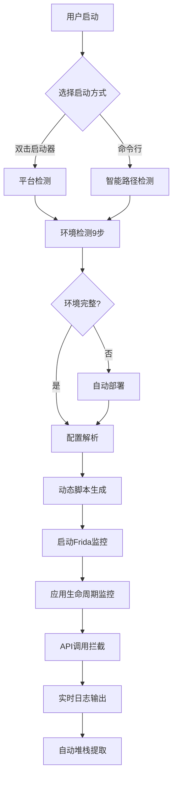

# Frida Android 隐私监控系统 v1.0

> 🔍 基于Frida的Android应用隐私API调用监控系统，专门用于检测应用在隐私协议同意前的敏感数据获取行为

[](https://github.com/your-repo/frida-privacy-monitor)
[](https://developer.android.com/)
[](LICENSE)
[](https://frida.re/)

**作者**: GodQ  
**版本**: v1.0 📦  
**更新时间**: 2025-06-05  
**里程碑**: 首个正式版本发布，智能化部署，跨平台支持

---

## 📋 目录

- [环境要求](#-环境要求)
- [快速开始](#-快速开始) 
- [项目功能](#-项目功能)
- [使用方法](#-使用方法)
- [配置说明](#-配置说明)
- [输出示例](#-输出示例)
- [高级功能](#-高级功能)
- [故障排除](#-故障排除)
- [更新日志](#-更新日志)
- [技术架构](#-技术架构)

---

## 🖥️ 环境要求

### 💻 本机环境

#### 操作系统支持
- **🍎 macOS** 10.14+ (推荐，原生支持)
- **🐧 Linux** Ubuntu 18.04+ / CentOS 7+ (完全兼容)
- **🪟 Windows** 10+ (通过WSL2或Git Bash)

#### 必需工具
```bash
# Python环境 (必需)
Python 3.7+

# Frida工具链 (必需)
pip install frida-tools

# Android开发工具 (必需)
Android SDK Platform Tools (adb命令)

# 网络工具 (二选一，用于下载frida-server)
curl 或 wget

# 解压工具 (必需)
unxz (用于解压frida-server)
```

#### 可选工具
```bash
# JSON解析工具 (可选，有备用方案)
jq

# 磁盘空间检查工具 (可选)
df 命令

# 数学计算工具 (可选)
bc 命令
```

### 📱 目标设备要求

#### 设备类型
- **🤖 Android模拟器** (推荐)
  - Android Studio AVD
  - Genymotion
  - BlueStacks等第三方模拟器
- **📱 物理设备**
  - 已Root的Android手机/平板

#### 系统要求
- **Android版本**: 5.0+ (API Level 21+)
- **架构支持**: ARM64, ARM, x86_64, x86
- **Root权限**: 必需 ⚠️
- **USB调试**: 已开启
- **存储空间**: 至少50MB可用空间

#### Root权限验证
```bash
# 检查Root权限
adb shell "id"
# 应返回: uid=0(root) gid=0(root) groups=0(root)

# 或者检查whoami
adb shell "whoami"  
# 应返回: root
```

### 🌐 网络要求

- **✅ 自动下载frida-server**: 需要访问GitHub (github.com)
- **✅ 离线使用**: 如已有frida-server文件，可完全离线运行
- **✅ 代理支持**: 支持HTTP/HTTPS代理配置

---

## 🚀 快速开始

### 🎯 方式一：一键双击启动（推荐新手）

根据你的操作系统，直接双击对应的启动器：

| 操作系统 | 启动文件 | 说明 |
|---------|---------|------|
| 🪟 Windows | `start_monitor.bat` | 自动检测Git Bash/WSL环境 |
| 🍎 macOS | `start_monitor.command` | 双击在终端中运行 |
| 🐧 Linux | `start_monitor_linux.sh` | 智能启动终端运行 |

**详细说明**: 参考 [`启动器使用说明.md`](启动器使用说明.md)

### 🛠️ 方式二：一键环境搭建（推荐开发者）

如果你在全新环境中搭建，运行环境搭建脚本：

```bash
# 一键完成所有环境配置
./tools/setup_frida_environment.sh
```

**脚本自动完成**：
1. 🔍 环境检测 - 操作系统、Python、工具链
2. 📱 设备检查 - ADB连接、架构识别、Root权限
3. ⚙️ Frida安装 - 自动安装/升级frida-tools
4. 📥 服务端部署 - 下载、部署、启动frida-server
5. ✅ 环境验证 - 完整的连接测试

### 🎮 方式三：直接运行（推荐有经验用户）

如果环境已就绪，直接运行监控脚本：

```bash
# 从项目根目录运行
./lib/start_monitor.sh

# 或从任意位置运行（智能路径检测）
/path/to/frida/lib/start_monitor.sh
```

### ⚡ 首次运行
无论选择哪种方式，首次运行会自动：
- 🔧 检测9个关键环境条件
- 📥 自动下载匹配的frida-server（如需要）
- 🚀 自动部署并启动frida-server
- ✅ 验证所有组件正常工作

---

## 📊 项目功能

### 🎯 核心监控功能

#### 🆔 设备标识符监控
- **Android ID** - 设备唯一标识符
- **IMEI/IMSI** - 设备/SIM卡标识
- **MAC地址** - 网络硬件地址  
- **设备序列号** - 硬件序列号

#### 📍 位置信息监控
- **GPS定位** - 精确位置获取
- **网络定位** - 基于WiFi/基站定位
- **位置权限检查** - LocationManager调用

#### 📱 系统信息监控
- **已安装应用列表** - PackageManager查询
- **联系人数据访问** - ContactsContract查询
- **剪贴板访问** - ClipboardManager操作
- **SIM卡信息** - 运营商和号码获取

#### 🎥 多媒体权限监控  
- **相机权限** - Camera.open调用
- **麦克风权限** - AudioRecord创建
- **录音行为** - 音频录制初始化

#### 📡 网络信息监控
- **WiFi连接信息** - SSID、BSSID获取
- **网络状态查询** - 连接信息获取

### 🔬 高级监控特性

#### ⏰ 调用时机分析
- **🔴 超早期调用** - Application构造函数前
- **🟡 早期调用** - Application.onCreate()前  
- **🟢 正常调用** - Application启动后

#### 🔄 生命周期监控
- **Application生命周期** - 构造、onCreate、生命周期事件
- **ContentProvider生命周期** - 数据提供者创建时机
- **服务生命周期** - Service相关隐私调用

#### 🎯 Flutter应用专项支持
- **Flutter引擎检测** - 自动识别Flutter应用
- **Flutter特殊API** - 适配Flutter框架特性
- **混合应用支持** - 原生+Flutter双重监控

#### 🔍 深度分析功能
- **反射调用检测** - 监控通过反射获取隐私信息
- **异常监控** - SecurityException等权限异常
- **完整堆栈跟踪** - 精确定位调用源码位置
- **调用链分析** - 完整的方法调用路径

### 🤖 智能化特性

#### 🛡️ 智能环境检测
9步全面环境验证：
1. Frida工具检查
2. ADB连接验证  
3. 设备权限检测
4. 架构兼容性检查
5. 磁盘空间验证
6. frida-server状态检查
7. Frida连接测试
8. 目标应用检查
9. 配置文件验证

#### 🚀 自动化部署
- **智能下载** - 根据设备架构自动选择frida-server版本
- **自动部署** - 推送、权限设置、启动一键完成
- **断点续传** - 支持网络中断后继续下载
- **离线模式** - 已有组件时完全离线运行

#### 🔧 配置化设计
- **JSON统一配置** - 所有参数集中在`frida_config.json`
- **动态脚本生成** - 根据配置自动生成监控脚本
- **模块化API** - 可灵活添加/删除监控项目
- **智能路径检测** - 无论从哪里运行都能找到正确路径

---

## 🎮 使用方法

### 📝 配置目标应用

编辑 `frida_config.json` 文件：

```json
{
  "monitor": {
    "targetPackage": "com.your.app.package",
    "logDir": "./build/logs", 
    "logPrefix": "privacy_log",
    "autoExtractStacks": true
  }
}
```

### 🚀 启动监控

选择以下任一方式启动：

#### 方式1：双击启动（最简单）
```bash
# Windows: 双击 start_monitor.bat
# macOS: 双击 start_monitor.command  
# Linux: 双击 start_monitor_linux.sh
```

#### 方式2：命令行启动
```bash
# 智能启动（推荐）
./lib/start_monitor.sh

# 传统方式
./tools/setup_frida_environment.sh  # 首次运行
./lib/start_monitor.sh
```

### 📊 监控输出

启动后会看到类似输出：

```
🚀 启动Frida隐私监控 v1.0...
🎯 目标应用: com.frog.educate
📋 监控脚本: privacy_monitor_template.js v1.0
📄 配置文件: frida_config.json  
🔧 优化: JSON统一配置，智能路径检测
📁 日志目录: ./build/logs
====================================

🔍 [1/9] 检查Frida工具...
✅ Frida工具已安装: 17.0.7

🔍 [2/9] 检查ADB连接...  
✅ 设备连接正常: emulator-5554

🔍 [3/9] 检测设备类型和权限...
✅ 设备已获得Root权限

... (9步检查完成)

🎉 环境检查完成! 所有条件均满足
=================================

🔧 [动态生成] 开始生成监控脚本...
✅ JS文件生成成功: build/privacy_monitor_generated.js
📊 配置注入: 14 个API

🔥 启动Frida隐私监控...
📁 日志文件: ./build/logs/privacy_log_2025-06-05_10-24-34.txt
```

### 📱 操作目标应用

监控启动后：
1. **目标应用自动启动** - Frida会自动启动目标应用
2. **正常使用应用** - 进行各种操作触发隐私API调用
3. **实时查看输出** - 终端实时显示捕获的API调用
4. **停止监控** - 按 `Ctrl+C` 停止监控

### 📄 查看结果

监控结束后：
- **📊 终端输出** - 实时显示的API调用信息
- **📁 日志文件** - 保存在 `./build/logs/` 目录
- **🔍 堆栈文件** - 自动提取的纯堆栈信息（如启用）

---

## ⚙️ 配置说明

### 📋 主配置文件：`frida_config.json`

```json
{
  "version": "1.0",
  "description": "Android隐私API监控统一配置文件",
  
  "monitor": {
    "targetPackage": "com.frog.educate",      // 目标应用包名
    "logDir": "./build/logs",                 // 日志目录
    "logPrefix": "privacy_log",               // 日志文件前缀
    "autoExtractStacks": true                 // 自动提取堆栈信息
  },
  
  "network": {
    "proxyUrl": "http://127.0.0.1:7897"      // 代理设置（可选）
  },
  
  "settings": {
    "enableLifecycleMonitor": true,          // 启用生命周期监控
    "enableReflectionMonitor": true,         // 启用反射调用监控
    "enableStackTrace": true,                // 启用堆栈跟踪
    "maxStackDepth": 10,                     // 最大堆栈深度
    "logLevel": "INFO"                       // 日志级别
  },
  
  "apis": [
    // 14个隐私API配置
    {
      "description": "Android ID监控",
      "className": "android.provider.Settings$Secure", 
      "methodName": "getString",
      "overloads": [["android.content.ContentResolver", "java.lang.String"]],
      "condition": "args[1] === 'android_id'",
      "logMessage": "获取设备唯一标识"
    }
    // ... 更多API配置
  ]
}
```

### 🔧 高级配置选项

#### 代理配置
```json
"network": {
  "proxyUrl": "http://proxy.company.com:8080"
}
```

#### 日志配置  
```json
"monitor": {
  "logDir": "./custom/logs",
  "logPrefix": "my_app_privacy",
  "autoExtractStacks": false
}
```

#### 监控范围配置
```json
"settings": {
  "enableLifecycleMonitor": false,    // 禁用生命周期监控
  "enableReflectionMonitor": false,   // 禁用反射监控  
  "maxStackDepth": 20                 // 增加堆栈深度
}
```

### 📝 添加自定义API监控

在 `apis` 数组中添加新的监控项：

```json
{
  "description": "自定义API监控",
  "className": "com.example.CustomClass",
  "methodName": "getPrivateData", 
  "overloads": [["java.lang.String"]],
  "condition": null,
  "logMessage": "获取自定义隐私数据"
}
```

---

## 📄 输出示例

### 🎯 实时监控输出

```
🚨 [1] [10:24:035.470] Android ID监控 (重载0)
⏰ 调用时机: 📱 正常调用 (Application.onCreate()后)
📋 API: android.provider.Settings$Secure.getString
📝 详情: 获取设备唯一标识 [android.content.ContentResolver,java.lang.String]
📥 传入参数: [
   [0] android.app.ContextImpl$ApplicationContentResolver@9fd5e7
   [1] android_id
]
📤 返回值: c48bd78e783ce8eb
📍 调用堆栈:
===== STACK_START =====
   java.lang.Exception
   at android.provider.Settings$Secure.getString(Native Method)
   at com.umeng.commonsdk.statistics.common.DeviceConfig.getAndroidId(DeviceConfig.java:236)
   at java.lang.reflect.Method.invoke(Native Method)
   at com.umeng.umzid.d.a(Unknown Source:31)
   at com.umeng.umzid.ZIDManager.a(Unknown Source:14)
===== STACK_END =====
------------------------------------------------------------
```

### 📊 监控统计

```
📊 Hook设置完成统计:
✅ 序列号监控
✅ Android ID监控  
✅ IMEI监控
✅ MAC地址监控
✅ 位置信息监控
✅ 应用列表监控
✅ 联系人查询监控
✅ 剪贴板监控
✅ SIM卡IMSI监控
✅ SIM卡序列号监控
✅ 手机号码监控
✅ 相机监控
✅ 音频录制监控
✅ WiFi连接信息监控

🎯 监控设置完成!
✅ 成功: 14 个
❌ 失败: 0 个  
📱 成功率: 100%
```

### 📁 日志文件

监控会生成以下文件：

```
build/logs/
├── privacy_log_2025-06-05_10-24-34.txt           # 完整日志
└── privacy_log_2025-06-05_10-24-34_stacks_only.txt  # 纯堆栈信息
```

**完整日志示例**：
```
🔍 Frida隐私监控系统启动...
🎯 目标应用: com.frog.educate
📅 启动时间: 06/05/2025, 10:24:34 AM
🔖 版本: Unified v1.0 (配置化统一监控)
============================================================

🚨 [1] [10:24:035.470] Android ID监控 (重载0)
⏰ 调用时机: 📱 正常调用 (Application.onCreate()后)
📋 API: android.provider.Settings$Secure.getString
📤 返回值: c48bd78e783ce8eb
📍 SDK分析: 友盟统计SDK (com.umeng.*)
```

---

## 🔬 高级功能

### 🧬 生命周期深度监控

监控应用各个生命周期阶段的隐私API调用：

```
🏗️ [生命周期] Application构造函数被调用
⏰ 时间: 10:24:034.222

🚀 [生命周期] Application.onCreate()被调用  
⏰ 时间: 10:24:034.236

🔗 [生命周期] ContentProvider.onCreate()被调用
⏰ 时间: 10:24:034.451
```

### 🔍 反射调用检测

自动检测通过反射获取隐私信息的行为：

```
🔮 [反射监控] 检测到反射调用
📋 类名: android.provider.Settings$Secure
📋 方法: getString
📋 调用者: com.umeng.commonsdk.statistics.common.DeviceConfig
```

### 📱 Flutter应用特殊支持

针对Flutter应用的特殊适配：

```
🎯 [Flutter检测] 检测到Flutter应用
📋 Flutter引擎版本: 3.10.2
📋 Dart版本: 2.19.6
🔧 启用Flutter专项监控模式
```

### 🚨 异常监控

监控权限相关异常：

```
⚠️ [异常监控] SecurityException捕获
📋 异常信息: java.lang.SecurityException: Permission denied
📋 缺失权限: android.permission.READ_PHONE_STATE
📋 调用位置: android.telephony.TelephonyManager.getDeviceId
```

### 📊 调用统计分析

```
📈 [统计分析] 隐私API调用统计 (运行时间: 2分35秒)
┌─────────────────────┬─────────┬─────────┐
│ API类型             │ 调用次数 │ 首次调用 │
├─────────────────────┼─────────┼─────────┤
│ Android ID          │ 3       │ 启动后  │
│ MAC地址             │ 1       │ 启动后  │ 
│ 应用列表            │ 2       │ 启动后  │
│ WiFi信息            │ 5       │ 启动后  │
└─────────────────────┴─────────┴─────────┘
```

---

## 🛠️ 故障排除

### 🔧 常见问题及解决方案

#### 1. Frida连接失败

**症状**: `frida-ps -U` 无响应或报错

**解决方案**:
```bash
# 检查frida-server是否运行
adb shell ps | grep frida-server

# 重启frida-server  
adb shell pkill frida-server
adb shell "/data/local/tmp/frida-server &"

# 检查端口是否被占用
adb shell netstat -tnlp | grep 27042
```

#### 2. 设备Root权限问题

**症状**: 提示"设备未获得Root权限"

**解决方案**:
```bash
# 重新获取Root权限
adb root
adb shell

# 检查Root状态
adb shell "whoami"  # 应返回 root
adb shell "id"      # 应显示 uid=0(root)
```

#### 3. 目标应用无法启动

**症状**: 应用启动失败或闪退

**解决方案**:
```bash
# 检查应用是否安装
adb shell pm list packages | grep your.package.name

# 清除应用数据
adb shell pm clear your.package.name

# 检查应用权限
adb shell dumpsys package your.package.name | grep permission
```

#### 4. 配置文件解析错误

**症状**: JSON解析失败

**解决方案**:
```bash
# 验证JSON格式
cat frida_config.json | jq .

# 检查常见错误
# - 缺少引号
# - 多余逗号
# - 括号不匹配
```

#### 5. 网络下载问题

**症状**: frida-server下载失败

**解决方案**:
```bash
# 设置代理
export https_proxy=http://your-proxy:port

# 手动下载
wget https://github.com/frida/frida/releases/download/17.0.7/frida-server-17.0.7-android-arm64.xz

# 使用配置文件代理
# 在frida_config.json中设置 network.proxyUrl
```

### 🔍 调试模式

启用详细调试信息：

```bash
# 设置调试模式
export FRIDA_DEBUG=1

# 运行监控
./lib/start_monitor.sh
```

### 📞 获取帮助

如果问题无法解决：

1. **📋 收集信息**:
   ```bash
   # 系统信息
   uname -a
   
   # Frida版本
   frida --version
   
   # 设备信息  
   adb shell getprop ro.product.cpu.abi
   adb shell getprop ro.build.version.release
   ```

2. **📝 提供日志**: 包含完整的错误日志和配置文件

3. **🎯 描述场景**: 详细描述操作步骤和期望结果

---

## 📚 更新日志

### 🎉 v1.0 (2025-06-05) - 首个正式版本

#### ✨ 重大新增
- **🚀 跨平台启动器**: Windows(.bat)、macOS(.command)、Linux(.sh) 双击启动
- **🧠 智能路径检测**: 无论从哪里运行都能自动定位项目根目录
- **📋 JSON统一配置**: 废弃key=value格式，全面使用JSON配置
- **🤖 智能化部署**: 9步环境检测，自动化问题修复
- **🔧 动态脚本生成**: 根据配置自动生成监控脚本

#### 🔄 功能优化
- **📊 实时统计报告**: Hook成功率、API调用统计
- **🎯 调用时机分析**: 区分超早期/早期/正常调用
- **🔍 深度堆栈跟踪**: 自动提取纯堆栈文件
- **📱 Flutter应用支持**: 专门适配Flutter框架
- **🛡️ 异常监控增强**: SecurityException等权限异常监控

#### 🐛 问题修复
- 修复JavaScript语法错误（字符串repeat方法）
- 修复路径不一致问题（工作目录统一）
- 修复配置文件残留问题
- 优化日志目录结构

#### 🏗️ 架构重构
- 模块化设计，核心功能集中在 `lib/` 目录
- 智能路径检测，支持从任意位置运行
- 统一的错误处理和用户提示
- 完善的文档和使用说明

### 📋 历史版本

---

## 🏗️ 技术架构

### 📁 项目结构

```
frida/
├── 🚀 启动器文件
│   ├── start_monitor.bat              # Windows双击启动器
│   ├── start_monitor.command          # macOS双击启动器
│   └── start_monitor_linux.sh         # Linux双击启动器
├── 📋 配置和文档
│   ├── frida_config.json              # 主配置文件
│   ├── README.md                      # 项目说明
│   └── 启动器使用说明.md              # 启动器使用指南
├── 📚 核心库 (lib/)
│   ├── start_monitor.sh               # 主启动脚本(智能路径检测)
│   ├── privacy_monitor_template.js    # Frida监控脚本模板
│   └── extract_stacks.sh              # 堆栈信息提取工具
├── 🔧 工具目录 (tools/)
│   └── setup_frida_environment.sh     # 环境搭建脚本
└── 📊 构建输出 (build/)
    ├── privacy_monitor_generated.js   # 动态生成的监控脚本
    ├── frida-server-android-arm64     # frida-server可执行文件
    └── logs/                          # 监控日志目录
        ├── privacy_log_*.txt          # 完整监控日志
        └── privacy_log_*_stacks_only.txt  # 纯堆栈信息
```

### 🔄 工作流程



### ⚙️ 核心技术

#### 🔧 Frida Hook技术
- **方法拦截**: 使用 `Java.use()` 和 `implementation` 拦截Java方法
- **字段访问**: 监控静态字段和实例字段访问
- **构造函数**: Hook类的构造函数监控对象创建
- **异常处理**: try-catch机制捕获和分析异常

#### 📊 数据采集技术
- **参数解析**: 自动解析方法参数类型和值
- **返回值捕获**: 记录方法返回值
- **堆栈跟踪**: `Java.use("java.lang.Exception").$new().getStackTrace()`
- **时间戳**: 精确到毫秒的调用时间记录

#### 🤖 智能化技术
- **环境检测**: Shell脚本+条件判断实现9步检测
- **路径解析**: `BASH_SOURCE` + `dirname` 实现智能路径定位
- **配置解析**: JSON.parse + 模板替换实现动态脚本生成
- **错误恢复**: 自动重试+用户引导实现故障自愈

### 🔒 安全特性

#### 🛡️ 权限检查
- Root权限验证
- USB调试确认
- frida-server权限设置

#### 🔐 数据保护
- 本地日志存储
- 敏感信息脱敏
- 配置文件验证

#### 🚨 异常处理
- 全面的try-catch覆盖
- 详细的错误提示
- 优雅的降级处理

---

## 📄 许可证

本项目采用 [MIT License](LICENSE) 开源协议。

## 🤝 贡献

欢迎提交Issue和Pull Request来改进项目！

## 🙏 致谢

- [Frida](https://frida.re/) - 强大的动态分析框架
- [Android Developer](https://developer.android.com/) - Android开发文档
- 所有贡献者和用户的反馈

---

**📞 联系作者**: GodQ  
**📅 最后更新**: 2025-06-05  
**🏷️ 版本**: v1.0